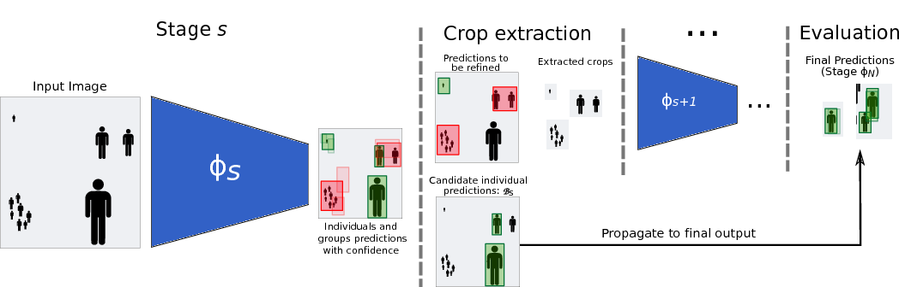
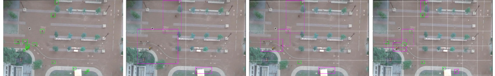

# [ODGI] Object Detection with Grouped Instances

This is a Tensorflow implementation for `ODGI: Object Detection with Grouped Instances`.

The library requirements are:

  * Tensorflow (1.4)
  * Python (3.5)
  * Numpy

### Model
Current state-of-the-art detection systems often suffer of two important shortcomings: processing speed and detecting objects at varying scales. In this project, we propose ODGI (*Object Detection with Grouped Instances*) a new detection scheme that addresses these issues; The main idea is to allow the detector to predict groups of objects rather than individuals, when it is needed. The proposed model allows working at lower resolution, thereby saving computations, and that the ability to identify groups leads to fewer, yet more meaningful, regions proposal than existing methods.




### Datasets
We originally experimented on the [VEDAI](https://downloads.greyc.fr/vedai/) dataset and the [Stanford Drone Dataset](http://cvgl.stanford.edu/projects/uav_data/). For each dataset, we provide, in the `Data` directory:

  * `{}_{train, test}` are TFRecords containing the dataset. Each example has features `im_id` (an image id that we use to resolve the path of the corresponding image), `num_boxes` (number of valid bounding boxes), `bounding_boxes` and `classes`.
  * `metadata_{}` contains paths to the train and test TFRecords for this dataset, path to the main image folder and other information (number of samples, etc.)
  * `{}_split{train, test}` contains the image IDS for the train and test split we used in our experiments
 

 
Additionally you'll need to have the images stored in some `image_folder` that you can modify in `metadata_{}`.
See the notebook `input_pipeline.ipynb` for how the images and annotations TFRecords are generated.

See the notebook `create_dataset.py` for how these datasets were created.

### Train the model

We provide scripts `train_standard.py` to train and evaluate  a standard `tiny-yolov2` model, and `train_odgi.py` to train and evaluate a two-stage ODGI pipeline.
Each notebook contains a configuration set-up and build the Tensorflow graph for both training and evaluation using functions defined in `net.py`, `loss_utils.py` and `eval_utils.py`.
The default configuration options and short descriptions can be found in `defaults.py`.

Most of the training process can be monitored via Tensorboard (the default output directory is `./log`). In particular we output the following summaries:

  * **[text]** `config_summary` contains all configuration options for the current run.
  * **[scalars]** We report the training losses (`train_tinyyolov2` for standard and `train_stage1` and `train_stage2` for ODGI).
  We also report running evaluation metrics. In particular the final detection metrics for both models are respectively `eval/tinyyolov2_avgprec_*` for standard and `eval/stage2_avgprec_*` for ODGI.
  * **[images]** Image summaries contain 
     * image *inputs* (vizualized with ground-truth bounding boxes, and empty cells at lower opacity), 
     * during training it contains the predicted *boxes assigned* to the ground-truth (before and after rescaling in the ODGI setting)
     * the *output bounding boxes* above a certain confidence threhsold (default is 0.5)
     * extracted *crops* after intermediate ODGI stages
     * group flag *confusion matrix*
     


### Launch a pre-trained model

`load_and_eval` is a small example of how to load a pretrained model (ODGI or standard) and compute detection metrics on a given dataset as well as output the resulting images. 


### Citation
If you found this code useful please cite 


```@article{odgi,
		        author = {Royer, Am\'{e}lie and Lampert, Christoph H.},
		        title = {Localizing Grouped Instances for Efficient Detection in Low-Resource Scenarios},
		        journal = {Winter Conference on Applications of Computer Vision (WACV)},
		        year = {2020}
		      }
```
